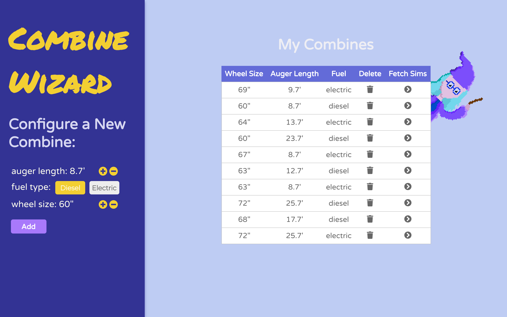
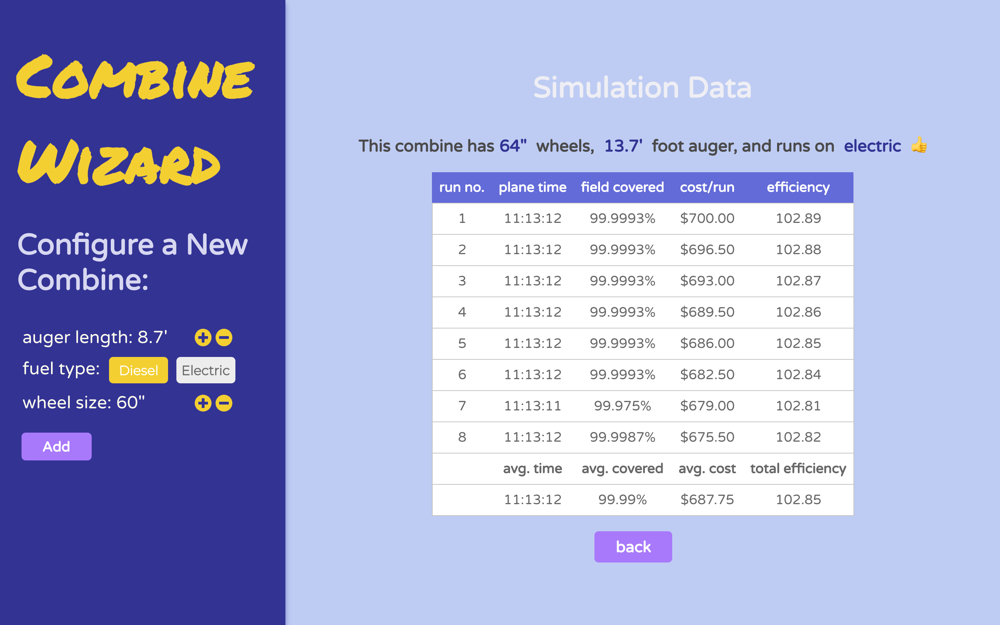
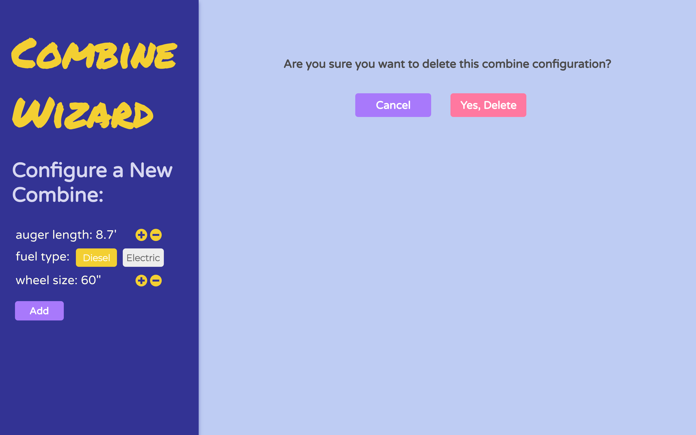
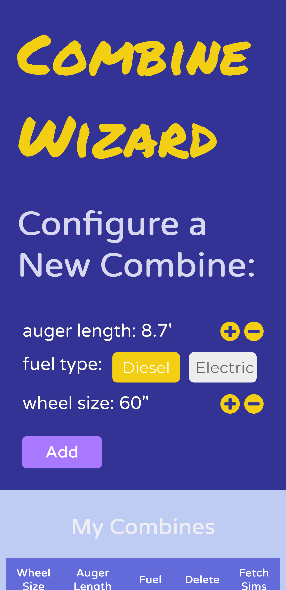
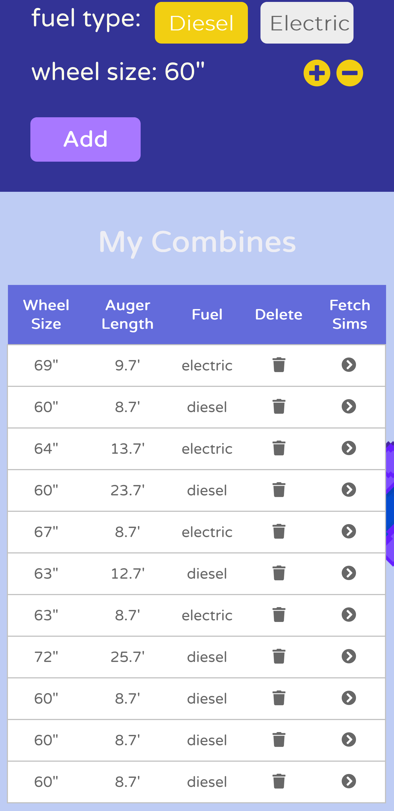

# Combine Automation Report Simulator (CARS)

## Description

This project is designed to help farmers evaluate autonomous combine [harvesting tractor] performance.

Users can specify auger length, fuel type, and a wheel size to create a combine.

Once a configuration is added, a simulation test fires every hour to measure the time that each particular combine takes to plane a 10 x 10 acre field, the percentage of the field covered, and the cost of the run.

The efficiency value of each simlation run is averaged to make an overall efficiency measure for each combine configuration.


## Installation and running locally:

Load the dependencies of the application:

```sh
cd path/to/CARS
yarn #npm install
```

Initialize amplify back end and create a new development environment from the amplify instructions from the CLI:

```sh
amplify init
```

The final output from amplify init outputs your GraphQL endpoint and your GraphQL API key. Save these values in `CARS/amplify/backend/function/runSimulations/src/.env`

```txt
# CARS/amplify/backend/function/runSimulations/src/.env

GRAPHQL_ENDPOINT="<your GraphQL endpoint>"
GRAPHQL_API_KEY="<your GraphQL API key>"
```

Push your API and lambda function to AWS:

```sh
amplify push
```

**To run the application locally**

To both bush your amplify resources and run the react front end, run:

```sh
amplify serve
```

...or just the front end with:

```sh
yarn start #npm run start
```

## Using the app:

Combine configurations are created on the React front end and saved to the DynamoDB backend.

Simulations are run using an hourly AWS lambda function which can be mocked locally by running:

```sh
amplify mock function runSimulations
```

**In order to view the simulation runs on the front end, be sure to run the script above and then refresh your browser. Every run, will mock one new simulation per combine configuration.**

This function takes in each combine configuration from the database and runs a simulation, inputting data to the Simulation table and updating the current number of simulation runs on each configuration.

## Tech Stack

- React
- GraphQL
- DynamoDB
- AWS Amplify
- AWS Lambda

## Assumptions && Limitations

### Calculations:

Each simulation randomly places three rock obstacles in the field, which the combine must avoid.

The calculations made to turn the combine and to avoid rocks are simple and do not directly reflect reality.

It assumes that the combine:

- Moves in straight lines only (no curves or diagonals were calculated).

- Turns on a pivot at 90 degree angles, thereby not missing any field in the process of turning. I did not calculate a turn radius.

- Does not slow down while turning

- Can pass the rock precisely and does not take extra room to avoid obstacles.

## Future Development Ideas

- implementing batch mutations in GraphQL for more efficient updates to DynamoDB tables

- add user authentication

- implement comparison options on the UI to allow users to directly compare the performance of two or more combines

- use data pulled from simulations to create graphs -- this would be especially interesting for the electric combines where cost per run decreases incrementally over time

## Screenshots

**Demo**


**Input form (left) and list of combine configurations (right)**



**Simulation data report from a selected combine configuration**



**Confirm before deleting a configuration**



**Responsive design**
On mobile


